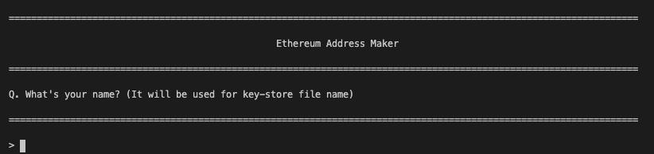
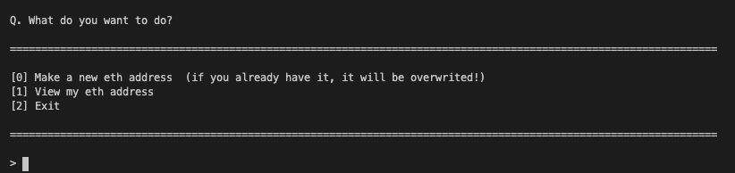

# 이더리움 주소와 토큰 만들기 / ethereum-adress-token

-  오픈소스를 활용한 이더리움 세트 메뉴

## 이더리움의 솔리디티 언어를 공부하며 제가 쓸 프로그램을 만들게 되었습니다. 

- 특히 콘솔 상호작용에 재미를 붙여 node.js 의 events를 이용한 간단한 계좌 생성/조회 콘솔을 작성하게 되었습니다. 
- 또한, 블록체인에서 화두가 된 토큰 개념을 이해하고자 오픈 소스 openzeppelin을 활용하였습니다.
- 이더리움 산하 ERC20 토큰 제작하는 프로젝트도 같이 세트로 묶었습니다.

## 주소 생성 콘솔 미리보기 / preview ethereum-address-maker





## erc20 토큰 생성 미리보기 / preview ethereum-erc20-token

```solidity
pragma solidity ^0.5.0;

import "@openzeppelin/contracts/token/ERC20/ERC20.sol";
import "@openzeppelin/contracts/token/ERC20/ERC20Detailed.sol";

contract ERC20Token is ERC20, ERC20Detailed {
    // 초기 할당량
    uint256 public INITIAL_SUPPLY = 12000;
                                // 이름, 심볼, 소수자리
    constructor() ERC20Detailed("ERC20", "ERC", 18) public {
        _mint(msg.sender, INITIAL_SUPPLY);
    }
}
```
