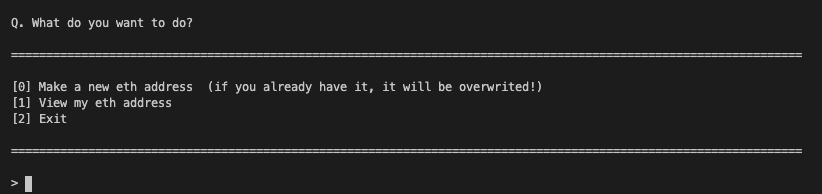

# Ethereum Address Maker

- web3 라이브러리를 이용한 이더리움 주소 만드는 콘솔
- crypto-js 라이브러리를 이용해서 이중 비밀번호 잠금
- PROVIDER = `https://mainnet.infura.io/`

```bash
npm run eth
```

## 미리보기 Preview




## 프로젝트 구조 Structure

```t
core/ --------- 메인 기능 폴더
ㄴ hex.js ------ 이더리움 주소 발급 소스
ㄴ view.js ----- 이더리움 주소 열람 소스
ex/ ------------ 기타 기능 폴더
ㄴ address.js --- 주소 유효성 체크 소스
ㄴ sign.js ------ 이더리움 서명 소스
console.js ------ 콘솔 인터랙션 소스
i1.png ---------- 스크린샷 1
i2.png ---------- 스크린샷 2
package.json ---- npm 설정 및 패키지 관리
README.md ------- 현재 보는 파일
```
